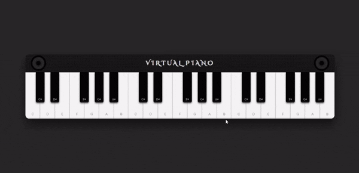

# 🎹 Virtual Piano — Interactive Web Instrument

A fully interactive **web-based piano** built using **HTML**, **SCSS**, and **JavaScript**.  
This project recreates a realistic piano experience with **multiple octaves**, **mouse & keyboard input**, **high-quality audio samples**, and **animated visual feedback**.

The focus is on **event handling**, **audio mapping**, **keyboard accessibility**, and **polished UI/UX**, making this a strong bridge between UI design and interactive logic.

---

## ✨ Features

- 🎹 **Multi-octave virtual piano (3 octaves)**
- 🖱️ **Mouse click support on keys**
- ⌨️ **Full keyboard key mapping**
- 🔊 **High-quality individual note audio**
- 🎨 **Realistic piano UI with white & black keys**
- ✨ **Animated floating music notes**
- 🎧 **Simultaneous audio playback**
- ⚡ **Instant key response with visual feedback**
- 📱 **Responsive and centered layout**

---

## 🌐 Live Demo / Review

You can play the piano live here:
👉 [Virtual Piano – Live Demo](https://harsh-codes-hub.github.io/Piano-TASK27/)

Use your keyboard or mouse to play notes and enjoy the visual effects 🎶

---

## 🗂️ File Structure
```bash
Piano-TASK27/
│
├── index.html          # Piano structure & keys layout
├── style.css           # Compiled CSS from SCSS
├── style.scss          # SCSS source (piano UI & animations)
├── script.js           # Piano logic & audio handling
├── preview.mp4         # Demo preview video
├── preview.gif         # Demo preview gif
│
├── /audio              # Individual note audio files
│   ├── C1.mp3
│   ├── CS1.mp3
│   ├── D1.mp3
│   ├── ...
│   └── B3.mp3
│
├── /favicon            # Website icons & manifest
│   ├── android-chrome-192x192.png
│   ├── android-chrome-512x512.png
│   ├── apple-touch-icon.png
│   ├── favicon-16x16.png
│   ├── favicon-32x32.png
│   ├── favicon.ico
│   └── site.webmanifest
│
└── README.md           # Project documentation
```

---

## 💻 Usage

1. **Clone the repository**
```bash
git clone https://github.com/Harsh-Codes-hub/Piano-TASK27.git
```

2. **Navigate to the project**
```bash
cd Piano-TASK27
```

3. **Open in browser**
```bash
open index.html
```

or simply double-click **index.html**

---

## ⌨️ Keyboard Shortcuts

### 🎼 Octave 1
| Key | Note |
| --- | ---- |
| Q   | C    |
| 2   | C#   |
| W   | D    |
| 3   | D#   |
| E   | E    |
| R   | F    |
| 5   | F#   |
| T   | G    |
| 6   | G#   |
| Y   | A    |
| 7   | A#   |
| U   | B    |

### 🎼 Octave 2
| Key       | Note |
| --------- | ---- |
| I         | C    |
| 9         | C#   |
| O         | D    |
| 0         | D#   |
| P         | E    |
| [         | F    |
| =         | F#   |
| ]         | G    |
| Backspace | G#   |
| \         | A    |
| ;         | A#   |
| .         | B    |

### 🎼 Octave 3
| Key | Note |
| --- | ---- |
| Z   | C    |
| S   | C#   |
| X   | D    |
| D   | D#   |
| C   | E    |
| V   | F    |
| G   | F#   |
| B   | G    |
| H   | G#   |
| N   | A    |
| J   | A#   |
| M   | B    |

---

## 🧠 Learning Highlights

- 🎧 Mapped **keyboard keys** to **musical notes**
- 🎹 Built a **multi-octave instrument system**
- 🔊 Managed **parallel audio playback**
- 🖱️ Synced **mouse & keyboard interactions**
- 🎨 Designed **realistic piano UI with SCSS**
- ✨ Added **animated visual feedback**
- 🧠 Improved understanding of **event delegation**

---

## 🧠 What Makes This Project Special

- 🎹 Feels like a **real playable instrument**
- ⌨️ Strong focus on **keyboard accessibility**
- 🎨 Highly polished **visual & audio experience**
- ⚡ Instant response with smooth **animations**
- 🧩 Pure JavaScript — no libraries

---

## 📸 Preview

_Interactive piano with animated notes and multi-octave support._



---

## 🛠️ Built With

- 🧾 **HTML5**
- 🎨 **CSS3 / SCSS**
- 🧩 **JavaScript (DOM & Audio API)**
- 🎧 **HTML Audio Elements**
- 🎹 **Keyboard Event Handling**

---

## 👨‍💻 Author

**Cohort 2.0 – Batch Task 27 Submission**
Created by **Harsh Gajrani** (_Harsh Codes Hub_)
Part of the **Cohort 2.0 batch at Sheryians Coding School**

Focused on **interactive UI, audio systems, keyboard accessibility, and user experience design**

---

_⭐ If you enjoy music + code or want to explore interactive web instruments, feel free to star the repository!_

---
